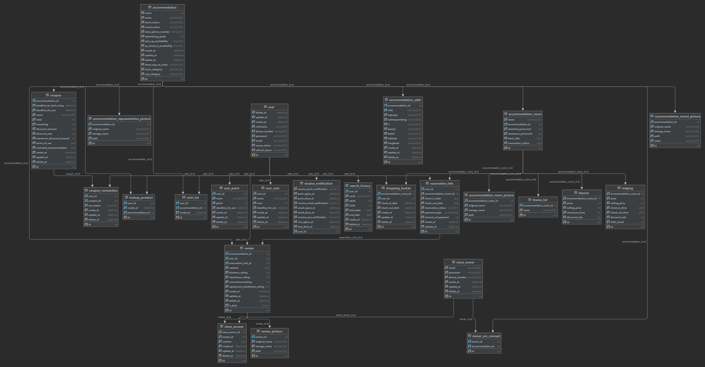

# 2022년 Rising Camp 5기 Server E반
## 야놀자 클론 코딩 개인 프로젝트

## 개요

실제로 서비스되고 있는 숙박 업소 예약 애플리케이션인 야놀자를 클론 코딩하면서 서버에 대한 역량을 키워보는 프로젝트이다.  
DB 설계, AWS 서버 생성 및 도메인 연결, HTTPS 적용, API 설계, 로그인 인증 과정을 진행하였다.

## 개발 환경
```
* Server : AWS EC2
* RDBMS : AWS RDS Mysql 8.0.28
* IDE :  Intellij, DataGrip
* Backend Server : Spring Boot
* Api Test Tool : Insomnia
* Api : KAKAO LOGIN API
```

### 설계

- DB 설계 - [ERD](https://drive.google.com/file/d/1oqPVChYGu1tWt1Iw7IIW9FD3q4jZKik2/view?usp=sharing)  


- API 명세서  

링크에서 확인 -> [API 명세서](https://docs.google.com/spreadsheets/d/1il4jZIhhv6HTboM9OLXG10OvAquY4f6A/edit?usp=sharing&ouid=103941929155283099338&rtpof=true&sd=true)

### 적용 기술

1. AWS EC2, AWS RDS MySQL
2. DNS 설정 및 HTTPS 적용
3. Spring Boot, JdbcTemplate
4. RESTful API
5. JWT, OAuth 2.0 (Kakao Login API)

### 기능 및 테스트

Notion에서 확인 가능 -> [Notion](https://maddening-spruce-1ee.notion.site/API-f4e6f38c6ec14312ad76a2c38b92ff6c)

## ✨License
- 본 템플릿의 소유권은 소프트스퀘어드에 있습니다. 본 자료에 대한 상업적 이용 및 무단 복제, 배포 및 변경을 원칙적으로 금지하며 이를 위반할 때에는 형사처벌을 받을 수 있습니다.
